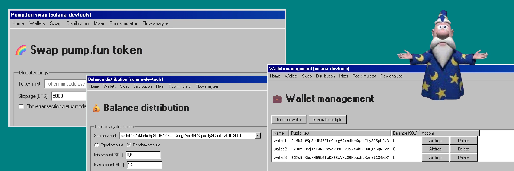
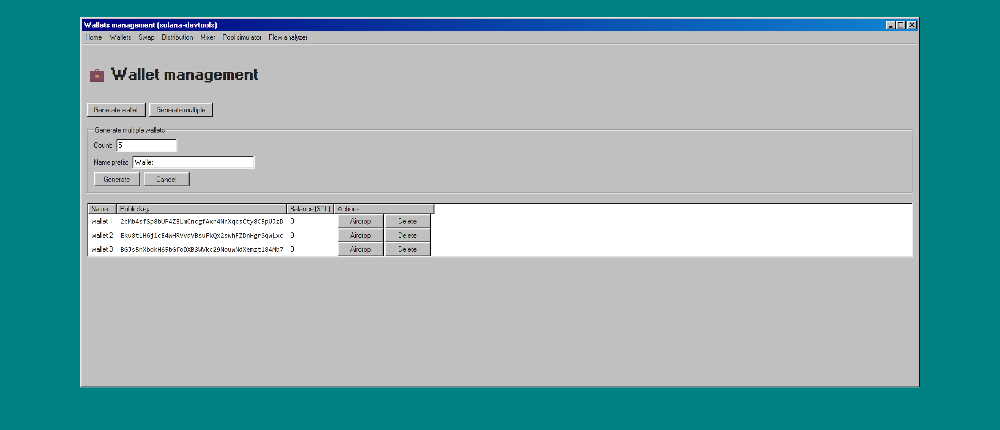
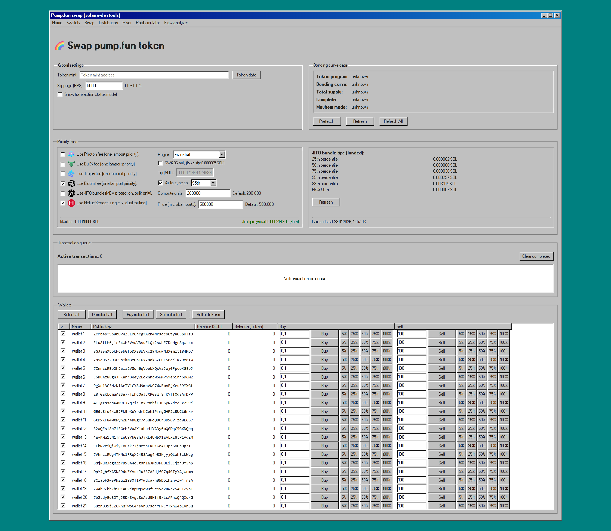
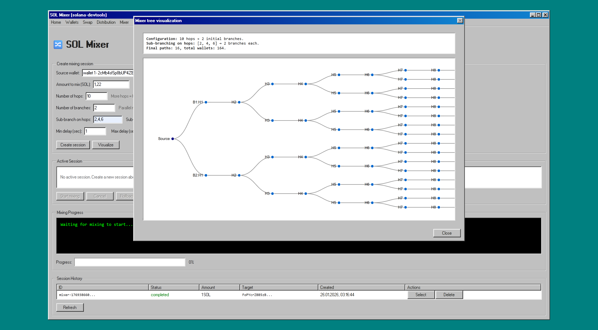
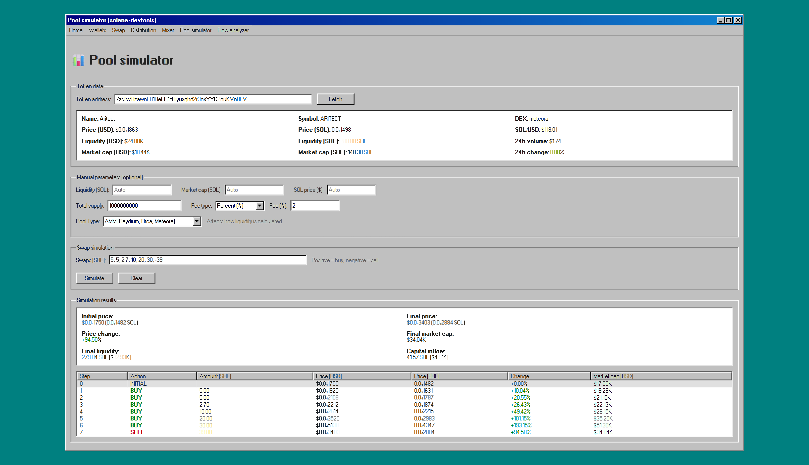
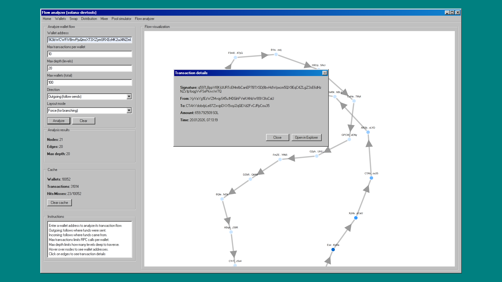

# solana-devtools

A comprehensive toolkit for Solana blockchain development and trading operations.

Solana Devtools is a self-hosted web application built with NestJS and Fastify, designed to streamline wallet management, token operations, and trading workflows on the Solana blockchain. It provides a modern web interface for managing multiple wallets, executing swaps on Pump.fun, mixing SOL for privacy, simulating AMM pools, and analyzing transaction flows.

## Disclaimer

This project is developed for research and educational purposes only. It is an ongoing development project created to explore Solana blockchain technologies and trading mechanisms. **This software must not be used for market manipulation or any illegal trading activities.** Users are solely responsible for ensuring their use complies with applicable laws and regulations.

## Security Warning

**Beware of fake repositories!** Only purchase and download from the official source. Fake or modified versions may contain malicious code designed to steal your funds and drain wallet balances. Always verify you are dealing with the legitimate seller before making any purchase.

**Important:** I will never contact you first via direct messages. Only use the official Telegram handle below. Beware of scammers impersonating me.

## Why Choose Solana Devtools

- **All-in-One Solution** — No need for multiple tools. Everything from wallet management to advanced trading in one interface.
- **Time-Saving** — Bulk operations across multiple wallets. What takes hours manually takes minutes.
- **MEV Protection** — Built-in JITO bundle support protects your trades from front-running.
- **Privacy First** — SOL mixer with multi-hop transactions for enhanced privacy.
- **Self-Hosted** — Your keys, your data, your control. Nothing leaves your machine.
- **Active Development** — Regular updates with new features based on user feedback.

## Features

### Wallet Management

- Generate and manage multiple Solana wallets.
- Real-time balance tracking via WebSocket subscriptions.
- Batch wallet generation.
- SOL distribution between wallets.
- Airdrop requests (devnet).

### Pump.fun Trading

- Execute buy and sell operations on bonding curves.
- Bulk swaps across multiple wallets.
- Configurable slippage and compute units.
- Real-time bonding curve state monitoring.

### JITO Bundle Support

- MEV-protected transaction bundles.
- Automatic endpoint rotation.
- Retry logic with exponential backoff.
- Tip account management.

### Helius Sender

- Fast transaction submission via Helius endpoints.
- SWQOS support for priority landing.
- Connection warming.
- Priority fee estimation.

### SOL Mixer

- Privacy-focused SOL mixing.
- Configurable hop counts and branching.
- Intermediate wallet generation.
- Rollback capability.

### Pool Simulator

- Simulate AMM pool behavior.
- Custom swap sequences.
- Real token data from DexScreener.
- Price impact calculation.

### Flow Analyzer

- Visualize transaction flows between addresses.
- Directed graph of SOL movements.
- Transaction history analysis.

### Real-time Updates

- Server-Sent Events (SSE) streaming.
- Live mint state updates.
- Swap status notifications.
- Transaction queue monitoring.

## Purchase

Two plans available:

### Basic ($99)

- Complete TypeScript source code.
- All modules and services.
- Installation guide.
- Configuration documentation.
- Access to private repository.
- Lifetime updates.

### Pro ($199)

Everything in Basic, plus:

- 1 month priority support via Telegram.
- Priority feature requests.
- Setup assistance.
- Configuration help.

**Payment:** USDT/USDC (Solana network)

Contact [@alxshelepenok](https://t.me/alxshelepenok) for purchase.

After payment, you'll receive access to the private GitHub repository.

## Requirements

- Bun.
- Solana RPC endpoint (Helius, QuickNode, or similar).
- Runs locally on your machine (Windows, macOS, Linux).

## Security

- Self-hosted solution, your keys never leave your machine.
- No external dependencies for key management.
- Local wallet storage with automatic backups.

## Frequently Asked Questions

**Q: Do I need coding experience?**

A: Basic command-line knowledge is helpful, but detailed installation instructions are provided.

**Q: Can I use this on multiple machines?**

A: The license is per-user, so yes, you can use it on your own devices.

**Q: Do you offer refunds?**

A: Due to the nature of digital products, refunds are not available. Please review the features carefully before purchasing.

**Q: How do updates work?**

A: You'll have permanent access to the private repository and can pull updates anytime.

**Q: Is this legal?**

A: The software is for personal use and research. You are responsible for compliance with your local regulations.

**Q: Which RPC provider should I use?**

A: We recommend Helius for mainnet operations, especially if using JITO bundles. QuickNode and Triton are also good alternatives.

**Q: Can I resell or share the source code?**

A: No. The license prohibits redistribution of source code. Violation will result in license termination without refund.

## License

This software is proprietary. Purchase grants a single-user license for personal or commercial use. Redistribution of source code is prohibited.

Copyright (c) 2026 Alexander Shelepenok. All rights reserved.
